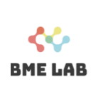
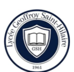
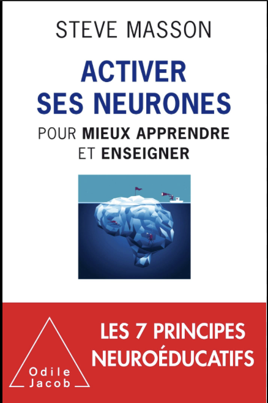
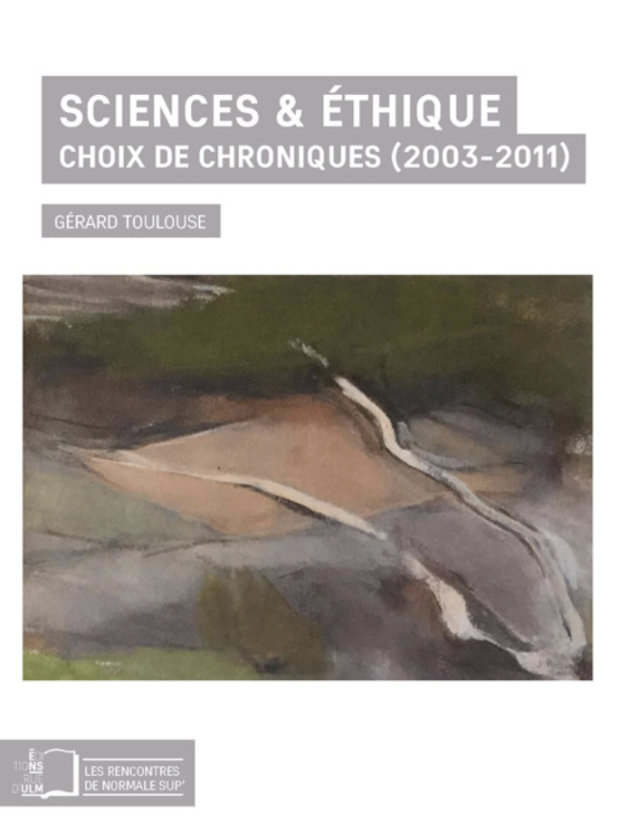
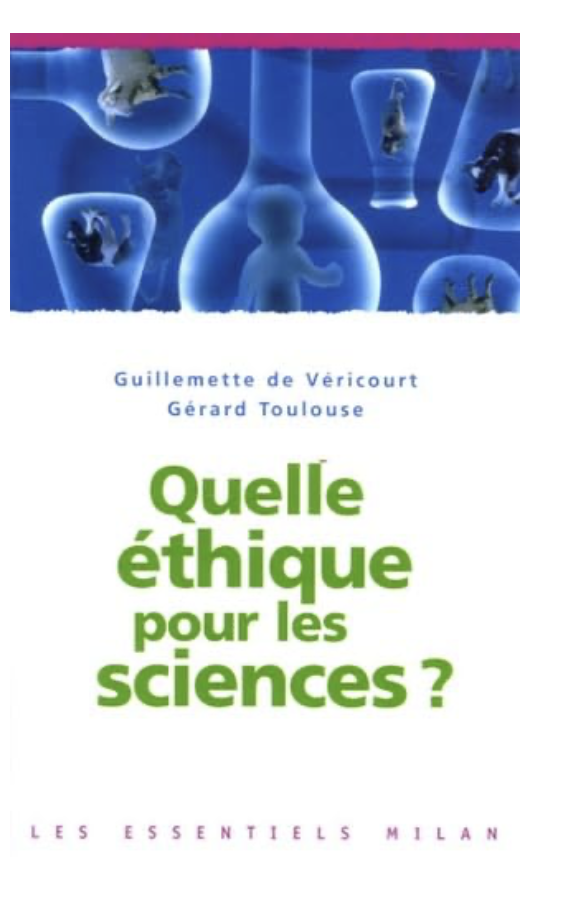

<!DOCTYPE html>
<html lang="fr">
<head>
<meta charset="UTF-8">
<meta name="viewport" content="width=device-width, initial-scale=1.0">
<title>Rûmeysa CAN — Portfolio</title>

</head>

<body>
<main>

  <!-- HERO -->
  <h1>Rûmeysa CAN</h1>
  

    Modélisation computationnelle des systèmes biologiques et neuronaux 
    Transcriptomique single-cell · Traitement du signal
  

  <h2>Axes</h2>
  

    <ul>
      <li>Transcriptomique single-cell et hétérogénéité cellulaire</li>
      <li>Traitement du signal neuronal et modélisation computationnelle</li>
    </ul>
  

  <h2>Projets</h2>

  

    <h3>Transcriptomique single-cell — Identification de populations cellulaires</h3>
    
<strong>Méthode :</strong> QC → normalisation → PCA → Leiden → UMAP (Scanpy)

    
    
<strong>Résultat :</strong> 6 clusters identifiés

    <a href="https://github.com/uruys/Analyse-cell-rnaseq" target="_blank" rel="noopener">GitHub</a>
  

  

    <h3>PRDM1 & Lupus — Analyse différentielle RNA-seq</h3>
    
<strong>Méthode :</strong> DESeq2 · correction FDR · réseau STRING

    
    
<strong>Résultat :</strong> PRDM1 identifié comme gène hub

    <a href="https://github.com/uruys/Bioinformatics_Lupus_PRDM1" target="_blank" rel="noopener">GitHub</a>
  

  

    <h3>Analyse EEG — Normal vs crise épileptique</h3>
    
<strong>Méthode :</strong> filtrage · FFT · puissance par bandes

    
    
<strong>Résultat :</strong> augmentation β/γ

    <a href="https://github.com/uruys/eeg-neuroscience-analyse" target="_blank" rel="noopener">GitHub</a>
  

  <!-- Projets en compact (sans étiquette “autres”) -->
  

    <strong>Surveillance SARS-CoV-2 (eaux usées)</strong> 
    Séries temporelles · signal précurseur ~5 jours 
    <a href="https://github.com/uruys/Projet_Biocapteurs" target="_blank" rel="noopener">GitHub</a>
  

  

    <strong>Tracking comportemental — DeepLabCut</strong> 
    Extraction métriques cinématiques · réduction annotation manuelle 
    <a href="https://github.com/uruys/computational-neuroscience-analysis" target="_blank" rel="noopener">GitHub</a>
  

  <h2>Expériences</h2>

  
  
<strong>BME Lab — Hôpital Saint-Joseph</strong> 
    Données cliniques (OMOP-CDM) · R / Python
  

  
  
<strong>NeuroPSI — CNRS Paris-Saclay</strong> 
    DeepLabCut · Électrophysiologie · Imagerie GCaMP
  

  <h2>Formation</h2>

  
  
<strong>Licence Sciences de la Vie</strong> Université Sorbonne Paris Nord

  
  
<strong>Baccalauréat Général</strong> Lycée Geoffroy Saint-Hilaire

  <h2>Photos</h2>
  

    
    
    
  

  <h2>Lecture</h2>
  

    
    
    
  

  

    
  

  <h2>Certifications</h2>
  

    
    
    
  

</main>
</body>
</html>
